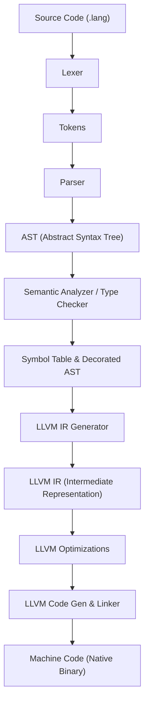

# Module 4: Mapping AST to the LLVM Backend

Congratulations, you have built the foundation of your compiler! Now, let's look at how your frontend merges with a backend. Specifically, we will look at **LLVM** (Low-Level Virtual Machine)—the industry-standard framework used by Clang, Rust, Swift, and Julia.

---

## 1. The Compiler Pipeline

Here is the path your code takes from plain text to runable binary:



---

## 2. What LLVM Handles for You (Save Time!)

Building code generators for x86, ARM, and WebAssembly is incredibly tedious. LLVM exists so you don't have to.

LLVM manages:
1.  **Register Allocation**: CPUs have a limited number of physical registers (like `rax`, `rbx` in x86). LLVM lets you write IR with an **infinite number of virtual registers** (`%1`, `%2`, `%3`), and it handles the complex math of mapping them to real hardware.
2.  **Architecture Targets**: Write code generator logic once (to LLVM IR), and it automatically compiles to Intel x86, AMD64, ARM (Apple Silicon), MIPS, PowerPC, or WebAssembly.
3.  **Industrial Optimizations**: LLVM has hundreds of optimization passes (dead-code elimination, loop unrolling, constant folding, inlining) that will make your language as fast as C/C++.

---

## 3. What the Frontend MUST Handle (Your Job)

Before you can hand your code to LLVM, your compiler frontend must perform **Semantic Analysis**.

LLVM IR is strongly and statically typed. It cannot compile `x + y` unless it knows:
*   Are `x` and `y` integers or floats?
*   Do they exist in this scope?
*   Should we use an integer add instruction (`add`) or a floating-point add instruction (`fadd`)?

### Step 1: Symbol Table & Lexical Environments
You must implement a **Symbol Table** (often called `Environment`) to track variable names, types, and scopes.

```go
type Env struct {
	parent *Env
	table  map[string]ast.Type
}

func NewEnv(parent *Env) *Env {
	return &Env{
		parent: parent,
		table:  make(map[string]ast.Type),
	}
}

func (e *Env) Define(name string, t ast.Type) {
	e.table[name] = t
}

func (e *Env) Lookup(name string) (ast.Type, bool) {
	t, exists := e.table[name]
	if exists {
		return t, true
	}
	if e.parent != nil {
		return e.parent.Lookup(name)
	}
	return nil, false
}
```

### Step 2: Semantic Analysis (Type Checking)
Before generating LLVM IR, walk your AST and check rules:
*   `let x: number = "hello";` ❌ **Semantic Error**: Type mismatch!
*   `y = 10;` (where `y` was never declared) ❌ **Semantic Error**: Undeclared variable!

---

## 4. Mapping AST Nodes to LLVM IR (Practical Code)

To write LLVM code in Go, use Go bindings for the LLVM C API, such as `tinygo-org/llvm`.

Here is a simplified conceptual example of how AST nodes map to LLVM IR generation functions:

### 1. Parsing Literals
An `ast.NumberExpr` maps to an LLVM float constant:
```go
// CodeGen for NumberExpr
func genNumber(builder llvm.Builder, node ast.NumberExpr) llvm.Value {
	// Create double-precision float constant in LLVM
	return llvm.ConstFloat(llvm.DoubleType(), node.Value)
}
```
*LLVM IR output:* `double 45.600000`

### 2. Binary Operations
A `BinaryExpr` maps to LLVM instructions depending on the type resolved by your Type Checker:
```go
func genBinary(builder llvm.Builder, node ast.BinaryExpr, env *Env) llvm.Value {
	leftVal := genExpr(builder, node.Left, env)
	rightVal := genExpr(builder, node.Right, env)

	// We check the type to choose the correct instruction!
	switch node.Operator.Kind {
	case lexer.PLUS:
		// Float Addition
		return builder.CreateFAdd(leftVal, rightVal, "tmpadd")
	case lexer.STAR:
		// Float Multiplication
		return builder.CreateFMul(leftVal, rightVal, "tmpmul")
	}
	panic("Unknown operator")
}
```
*LLVM IR output:* `%tmpadd = fadd double %1, %2`

### 3. Variable Declarations
Variables are generated by allocating stack memory using `Alloca` and storing values:
```go
func genVarDec(builder llvm.Builder, node ast.VarDecStmt, env *Env) {
	// 1. Allocate space on the stack for the variable
	varType := mapToLLVMType(node.ExplicitType)
	ptr := builder.CreateAlloca(varType, node.VariableName)
	
	// 2. Register it in our LLVM Value Table so we can retrieve it when accessed
	env.RegisterLLVMValue(node.VariableName, ptr)
	
	// 3. Store the initial value if provided
	if node.AssignedValue != nil {
		val := genExpr(builder, node.AssignedValue, env)
		builder.CreateStore(val, ptr)
	}
}
```
*LLVM IR output:*
```llvm
%x = alloca double, align 8
store double 10.0, double* %x, align 8
```

---

## 🎓 MIT Professor's Note: SSA Form (Single Static Assignment)
> "LLVM IR is written in SSA form. In SSA form, every register can only be assigned **exactly once** (e.g. `%1 = add ...`, `%2 = mul ...`). You cannot write `%1 = add ...` and then `%1 = sub ...`. To handle reassignable variables in your language (like `x = x + 1`), you allocate stack variables using LLVM's `alloca` instruction and then use `load` and `store` to change their values. LLVM's optimization passes will later clean this up and optimize stack allocations back into raw CPU registers automatically."

## 💻 SWE Tips & Tricks
1.  **Start with the Interpreter**: Before trying to write LLVM IR, write a simple AST Interpreter. Walking the AST to evaluate expressions directly in Go will teach you how scopes and symbol tables work without fighting LLVM APIs.
2.  **Generate Textual IR first**: Instead of using library bindings, you can initially generate textual LLVM IR (as a `.ll` string file) using simple `printf` statements. You can compile this text file using LLVM's command-line tool: `clang main.ll -o main`. This makes debugging extremely visual!
3.  **Read Clang's IR**: Unsure what LLVM IR is supposed to look like for a class, loop, or struct? Write a tiny file in C, and run `clang -S -emit-llvm file.c`. Read the output `.ll` file. It will show you exactly what LLVM IR code Clang produces for those features.
