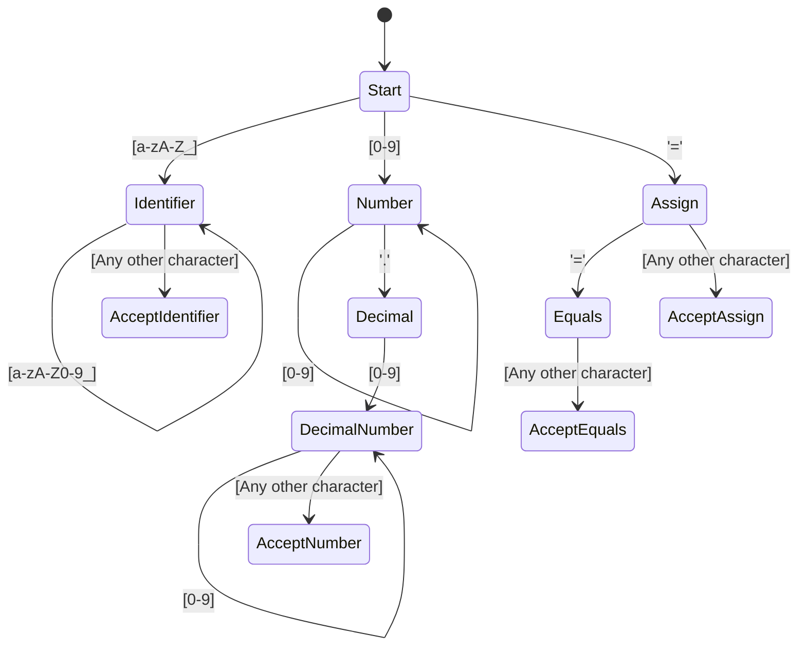

# Module 5: Manual Lexing (DFA State Machines without Regex)

In production compilers (like GCC, Clang, Go, and Rust), **regular expressions are almost never used** for tokenization. 

### Why Avoid Regex for Lexers?
1.  **Performance**: Regexp engines use backtracking and arbitrary search structures that make them slow. A manual lexer passes over the source text exactly once (O(N) complexity).
2.  **State and Context**: Tracking exact line/column positions, handling nested comments (like `/* block comments /* nested */ */`), and decoding string escape sequences (like translating `\n` to a newline byte) are extremely difficult or impossible with regex.
3.  **Control**: Manual lexers can fail gracefully, reporting exact error columns and attempting error recovery immediately.

Let's connect your Theory of Automata and Formal Languages (TAFL) knowledge to practical code.

---

## 1. The Theory: Lexers as Deterministic Finite Automata (DFA)

In TAFL, a **DFA** consists of states, input characters, and transition rules. A lexer is simply a DFA that matches character sequences and outputs tokens when it reaches an "accepting state".

For example, here is a DFA diagram for parsing numbers, identifiers, and equal operators:



### The Transition to Code
Instead of writing a formal mathematical state table, we write a **switch-case statement inside a loop**.
*   The current character we are inspecting is our **current input symbol**.
*   Our helper functions (like `peek()`) look ahead to determine transition states.
*   The loop index `pos` represents the state transitions.

---

## 2. Structural Setup of a Manual Lexer

Here is the template for a clean manual lexer in Go:

```go
package lexer

import (
	"unicode"
)

type Lexer struct {
	source   string
	pos      int
	line     int
	col      int
	filename string
}

func NewLexer(filename string, source string) *Lexer {
	return &Lexer{
		source:   source,
		pos:      0,
		line:     1,
		col:      1,
		filename: filename,
	}
}

// peek returns the current character without consuming it
func (l *Lexer) peek() byte {
	if l.pos >= len(l.source) {
		return 0 // Null character represents EOF
	}
	return l.source[l.pos]
}

// peekNext looks 1 character ahead
func (l *Lexer) peekNext() byte {
	if l.pos+1 >= len(l.source) {
		return 0
	}
	return l.source[l.pos+1]
}

// advance consumes the current character and returns it
func (l *Lexer) advance() byte {
	char := l.peek()
	if char == '\n' {
		l.line++
		l.col = 1
	} else {
		l.col++
	}
	l.pos++
	return char
}
```

---

## 3. Implementing the State Transitions

Now, we loop through the source string, using our state machine logic.

```go
func (l *Lexer) Tokenize() []Token {
	tokens := []Token{}

	for l.peek() != 0 {
		char := l.peek()

		// 1. Skip Whitespace
		if unicode.IsSpace(rune(char)) {
			l.advance()
			continue
		}

		// 2. Comments (State: started with '/')
		if char == '/' && l.peekNext() == '/' {
			// Consume '//' and everything until newline
			l.advance()
			l.advance()
			for l.peek() != '\n' && l.peek() != 0 {
				l.advance()
			}
			continue
		}

		// 3. Numbers (State: started with a digit)
		if unicode.IsDigit(rune(char)) {
			tokens = append(tokens, l.readNumber())
			continue
		}

		// 4. Identifiers & Keywords (State: started with a letter/underscore)
		if unicode.IsLetter(rune(char)) || char == '_' {
			tokens = append(tokens, l.readIdentifier())
			continue
		}

		// 5. String Literals (State: started with '"')
		if char == '"' {
			tokens = append(tokens, l.readString())
			continue
		}

		// 6. Operators & Separators (Multi-character transitions)
		startPos := Position{Filename: l.filename, Line: l.line, Col: l.col}
		switch char {
		case '=':
			l.advance()
			if l.peek() == '=' {
				l.advance()
				tokens = append(tokens, Token{Kind: EQUALS, Value: "==", Pos: startPos})
			} else {
				tokens = append(tokens, Token{Kind: ASSIGNMENT, Value: "=", Pos: startPos})
			}
		case '!':
			l.advance()
			if l.peek() == '=' {
				l.advance()
				tokens = append(tokens, Token{Kind: NOT_EQUALS, Value: "!=", Pos: startPos})
			} else {
				tokens = append(tokens, Token{Kind: NOT, Value: "!", Pos: startPos})
			}
		case '+':
			l.advance()
			if l.peek() == '+' {
				l.advance()
				tokens = append(tokens, Token{Kind: PLUS_PLUS, Value: "++", Pos: startPos})
			} else if l.peek() == '=' {
				l.advance()
				tokens = append(tokens, Token{Kind: PLUS_EQUALS, Value: "+=", Pos: startPos})
			} else {
				tokens = append(tokens, Token{Kind: PLUS, Value: "+", Pos: startPos})
			}
		// ... handle other symbols like { } ( ) [ ] ; , etc.
		default:
			panic(fmt.Sprintf("Lexer Error: Unknown character '%c' at line %d, col %d", char, l.line, l.col))
		}
	}

	tokens = append(tokens, Token{Kind: EOF, Value: "EOF", Pos: Position{Filename: l.filename, Line: l.line, Col: l.col}})
	return tokens
}
```

---

## 4. Helper Lexer State Handlers

Let's write the methods for reading multi-character literals cleanly.

### Parsing Numbers (Decimal State Transition)
```go
func (l *Lexer) readNumber() Token {
	startPos := Position{Filename: l.filename, Line: l.line, Col: l.col}
	startOffset := l.pos
	
	// Read digits
	for unicode.IsDigit(rune(l.peek())) {
		l.advance()
	}
	
	// Read optional decimal point
	if l.peek() == '.' && unicode.IsDigit(rune(l.peekNext())) {
		l.advance() // Consume '.'
		for unicode.IsDigit(rune(l.peek())) {
			l.advance() // Consume decimal digits
		}
	}
	
	value := l.source[startOffset:l.pos]
	return Token{Kind: NUMBER, Value: value, Pos: startPos}
}
```

### Parsing Identifiers & Keywords
```go
func (l *Lexer) readIdentifier() Token {
	startPos := Position{Filename: l.filename, Line: l.line, Col: l.col}
	startOffset := l.pos
	
	for unicode.IsLetter(rune(l.peek())) || unicode.IsDigit(rune(l.peek())) || l.peek() == '_' {
		l.advance()
	}
	
	value := l.source[startOffset:l.pos]
	
	// Lookup keyword table
	kind := INDENTIFIER
	if reservedKind, exists := reserved_lu[value]; exists {
		kind = reservedKind
	}
	
	return Token{Kind: kind, Value: value, Pos: startPos}
}
```

### Parsing String Literals (with Escapes!)
```go
func (l *Lexer) readString() Token {
	startPos := Position{Filename: l.filename, Line: l.line, Col: l.col}
	l.advance() // Consume opening quote '"'
	
	var sb strings.Builder
	for l.peek() != '"' && l.peek() != 0 {
		char := l.peek()
		
		// If we encounter a backslash, decode the escape sequence!
		if char == '\\' {
			l.advance() // Consume '\\'
			switch l.peek() {
			case 'n':
				sb.WriteByte('\n')
			case 't':
				sb.WriteByte('\t')
			case '"':
				sb.WriteByte('"')
			case '\\':
				sb.WriteByte('\\')
			default:
				panic(fmt.Sprintf("Invalid escape sequence \\%c", l.peek()))
			}
			l.advance() // Consume escaped character
		} else {
			sb.WriteByte(l.advance())
		}
	}
	
	if l.peek() == 0 {
		panic("Lexer Error: Unterminated string literal")
	}
	
	l.advance() // Consume closing quote '"'
	return Token{Kind: STRING, Value: sb.String(), Pos: startPos}
}
```

---

## 🎓 MIT Professor's Note: Maximal Munch Rule
> "When parsing operators, how does the DFA decide whether to parse `<` and `=` as separate tokens or as a single `<=` token? We follow the **Maximal Munch Rule** (also known as the *longest match* rule). The lexer always consumes the longest possible character sequence that forms a valid token. If it starts with `<`, and the next char is `=`, it must consume both to produce a single `LESS_EQUALS` token."

## 💻 SWE Tips & Tricks
1.  **String Builder vs Slicing**: For identifiers and numbers, slicing the source string (`source[start:end]`) is extremely fast because it doesn't allocate memory. For string literals with escape codes, you *must* use a `strings.Builder` because the output string contains different characters (e.g. a single newline byte instead of `\` and `n`).
2.  **Sentinels**: Using `0` as a sentinel value for EOF keeps your conditions clean. You can read `l.peek()` without checking if `pos < len(source)` every single time, since `peek()` returns `0` at EOF.
3.  **Fast Path**: Keep standard operations as short switch-case statements. A single character match in a `switch` statement in Go is compiled into an optimized jump table, which runs incredibly fast.
